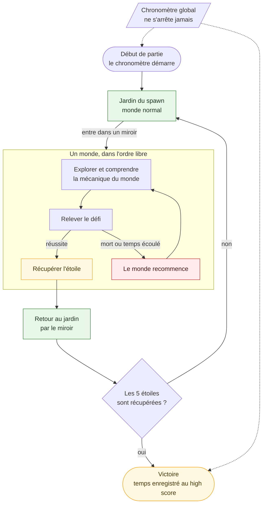

<div align="center">

# GLASS GARDEN

**Dossier de Game Design**

`SAE — Thème : Monde onirique`

**Équipe :** `Lilian` · `Lea` · `Hina`

*Version 0.1 — document vivant, à compléter au fil du développement*

</div>

---

## Sommaire

1. [Concept](#1--concept)
2. [Univers et ambiance](#2--univers-et-ambiance)
3. [Boucle de jeu](#3--boucle-de-jeu)
4. [Les cinq mondes](#4--les-cinq-mondes)
5. [Contrôles](#5--contrôles)
6. [Modes de jeu](#6--modes-de-jeu)
7. [Direction artistique et audio](#7--direction-artistique-et-audio)
8. [Contraintes techniques](#8--contraintes-techniques)
9. [Architecture du projet](#9--architecture-du-projet)
10. [Planning et organisation](#10--planning-et-organisation)
11. [Points ouverts](#11--points-ouverts)

---

## 1 · Concept

> **Glass Garden** est un jeu d'aventure 2D en vue du dessus, en pixel art.
> Au centre d'un jardin paisible se trouvent des miroirs. Chacun ouvre sur une **version alternée de la maps** : la nuit, un rêve, un automne, un monde en ruines, un jardin magique.
> Dans chaque miroir se cache **une étoile**. Il faut toutes les récupérer, puis revenir dans le monde normal, **le plus vite possible**.

| | |
|---|---|
| **Genre** | Aventure / exploration à mécaniques variées |
| **Vue** | 2D, vue du dessus |
| **Style** | Pixel art |
| **Joueurs** | 1 (solo), 2 en coopération ou en compétition |
| **Plateforme cible** | Borne d'arcade (16:9, 1280 × 720) |
| **Moteur** | Phaser (JavaScript) |
| **Thème imposé** | Monde onirique |

### Pitch en une phrase

*Traverse les miroirs d'un jardin, survis à cinq versions de la réalité, rapporte cinq étoiles, et bats le chronomètre.*

---

## 2 · Univers et ambiance

Inspiré d'**Alice au pays des merveilles** : un passage vers un autre monde, des personnages étranges, une logique de rêve.

Le jardin du départ est le **monde normal**, calme et lumineux. Les miroirs sont les portails. Chaque monde est une **déclinaison du même jardin**, avec sa propre lumière, sa palette de couleurs, ses règles et ses habitants.

Le principe narratif est simple : **un même lieu, plusieurs réalités**. Un personnage peut exister dans plusieurs mondes, avec une personnalité différente. Passer d'un miroir à l'autre permet d'en apprendre plus sur lui.

### Pistes d'ambiances

| Monde | Ambiance | Couleurs dominantes |
|---|---|---|
| Jardin (spawn) | Calme, accueillant | Verts, lumière naturelle |
| Monde 1 | Nuit, mystérieux | Bleus profonds, lueur de bougie |
| Monde 2 | Rêve, éthéré, inquiétant | Blancs, roses pâles, nuages |
| Monde 3 | Automne, mélancolique | Oranges, bruns, ocres |
| Monde 4 | Post-apocalyptique, désolé | Gris, rouille, poussière |
| Monde 5 | Magique, merveilleux | Violets, dorés, turquoise |

---

## 3 · Boucle de jeu



*Si le diagramme ne s'affiche pas dans votre éditeur, il se lit ainsi : jardin, miroir, monde, défi, étoile, retour au jardin, et on recommence jusqu'à la cinquième étoile. En cas d'échec, seul le monde en cours recommence.*

### Règles générales

- Les **mondes sont accessibles dans l'ordre que l'on veut**.
- Chaque monde contient **une seule étoile**, obtenue en relevant le défi du monde.
- **Victoire :** avoir récupéré les 5 étoiles **et** être revenu dans le monde normal.
- **Échec (mort, temps écoulé) :** le joueur recommence **le monde en cours**. Le chronomètre global, lui, **ne s'arrête pas**.
- Un **chronomètre global** tourne en continu pour établir un **high score**, en solo et en multijoueur.

---

## 4 · Les cinq mondes

Chaque monde est bâti sur une base commune (déplacement, collisions, étoile, sortie par le miroir) à laquelle s'ajoute **une mécanique propre**.

---

### Monde 1 · La Nuit

| | |
|---|---|
| **Ambiance** | Jardin plongé dans l'obscurité |
| **Mécanique** | Exploration à la lueur d'une lampe / bougie |
| **Objectif** | Trouver l'étoile |
| **Difficulté** |  |

Le monde d'introduction. On y apprend à se déplacer dans un lieu sombre, uniquement éclairé par un halo autour du joueur. L'étoile est simplement posée quelque part dans le jardin, il suffit de la trouver et de la ramasser.

**À faire :** effet d'obscurité avec halo lumineux · placement de l'étoile.

---

### Monde 2 · Le Rêve

| | |
|---|---|
| **Ambiance** | Ciel de rêve, le sol est fait de nuages |
| **Mécanique** | Combat à distance contre les monstres de cauchemar |
| **Ennemis** | Squelettes |
| **Objectif** | Vaincre les monstres pour obtenir l'étoile |
| **Difficulté** |  |

Le joueur **tire** sur des squelettes. Un seul contact avec un ennemi ou un projectile suffit à le faire **mourir : le monde recommence**. La précision et le placement sont donc essentiels.

**À faire :** système de tir (réutilisé au monde 4) · ennemis avec déplacement simple · gestion de la mort et du redémarrage du monde.

---

### Monde 3 · L'Automne

| | |
|---|---|
| **Ambiance** | Le même jardin, décliné en automne |
| **Mécanique** | Énigme posée par un petit monstre |
| **Objectif** | Résoudre l'énigme pour recevoir l'étoile |
| **Difficulté** |  |

Le joueur dialogue avec un **petit monstre** qui détient l'étoile. Bien répondre à son énigme la lui fait céder.

>  **Énigme à définir.** Pistes : une devinette à choix multiples · trois objets à retrouver dans le jardin · des feuilles à ranger dans le bon ordre.

**À faire :** système de dialogue · énigme · objet(s) interactif(s).

---

### Monde 4 · L'Apocalypse

| | |
|---|---|
| **Ambiance** | Jardin dévasté, post-apocalyptique |
| **Mécanique** | Tir sur des boîtes |
| **Objectif** | Trouver l'étoile cachée dans l'une des boîtes |
| **Difficulté** |  |

Le joueur doit d'abord **trouver l'arme**, placée plus loin sur la map. Il peut ensuite tirer sur les boîtes pour découvrir laquelle cache l'étoile.

>  **À préciser :** cherche-t-on l'étoile au hasard, ou un indice désigne-t-il la bonne boîte ?

**À faire :** ramassage de l'arme · boîtes destructibles · réutilisation du système de tir du monde 2.

---

### Monde 5 · La Magie

| | |
|---|---|
| **Ambiance** | Jardin magique, un sorcier veille |
| **Mécanique** | Collecte chronométrée |
| **Objectif** | Rapporter des diamants à un PNJ avant la fin du temps imparti |
| **Difficulté** |  |

Un **sorcier** demande des diamants. Le joueur doit les rassembler avant la fin d'un **compte à rebours**. En cas d'échec, le monde recommence.

**À faire :** collectibles · compte à rebours propre au monde · dialogue avec le PNJ.

---

### Récapitulatif

| # | Monde | Mécanique | Système clé |
|---|---|---|---|
| 1 |  Nuit | Exploration dans le noir | Lumière / halo |
| 2 |  Rêve | Tir sur des squelettes | Tir + ennemis + mort |
| 3 |  Automne | Énigme d'un monstre | Dialogues |
| 4 |  Apocalypse | Tir sur des boîtes | Tir + objets |
| 5 |  Magie | Diamants à temps | Compte à rebours + PNJ |

---

## 5 · Contrôles

### Actions du jeu

| Action | Clavier J1 | Clavier J2 | Borne d'arcade |
|---|---|---|---|
| Se déplacer | `Z` `Q` `S` `D` | Flèches | Joystick |
| Courir | `Maj` *(à définir)* | *(à définir)* | Bouton *(à définir)* |
| Interagir (miroir, objet, PNJ) | `E` *(à définir)* | *(à définir)* | Bouton *(à définir)* |
| Tirer | *(à définir)* | *(à définir)* | Bouton *(à définir)* |
| Lampe / bougie | *(à définir)* | *(à définir)* | Bouton *(à définir)* |
| Pause | `Échap` | — | Bouton *(à définir)* |

### La borne d'arcade

La borne est prévue pour **deux joueurs** : chacun dispose d'**un joystick et de six boutons**. Toutes les touches sont centralisées dans un seul module (`InputManager`) : le jeu ne parle que d'**actions** (« interagir », « tirer »…), jamais de touches. Brancher la borne consiste donc à associer ses boutons à ces actions, sans toucher au reste du code.

---

## 6 · Modes de jeu

| Mode | Description | Statut |
|---|---|---|
| **Solo** | Un joueur récupère les 5 étoiles contre le chronomètre | Prioritaire |
| **Coopération** | Deux joueurs relèvent les épreuves ensemble | Prévu |
| **Compétition** | Deux joueurs se disputent le meilleur temps | Si le temps le permet |

### Split screen

Quand les deux joueurs sont dans **des mondes différents**, l'écran se **divise en deux**, un par joueur, et le chronomètre continue pour tout le monde. Si un joueur entre dans le miroir de l'autre, il l'**engloutit** : les deux se retrouvent alors dans le même monde, sur un écran unique.

> Cette partie est **volontairement mise de côté** pour le moment. Le code est conçu pour l'accueillir plus tard.

### High score

Le temps total est sauvegardé pour chaque mode (solo et multijoueur), afin de pouvoir **se comparer et rejouer** pour faire mieux.

---

## 7 · Direction artistique et audio

### Style visuel

- **Pixel art**, vue du dessus.
- Une **palette de couleurs par monde** : c'est elle qui transmet l'ambiance, pas besoin de dessiner des décors radicalement différents.
- Personnages : deux sprites jouables (joueur 1 et joueur 2).
- Éléments de base : tuile de sol, tuile de mur, miroir, éléments de décor.

### Écrans

- Écran d'accueil
- Écran des contrôles
- Jardin du spawn (hub)
- Les cinq mondes
- Écran de victoire avec le temps et le high score

### Avancement des assets

- [x] Sprites : personnage 1 et personnage 2
- [x] Tuile de sol
- [x] Tuile de mur
- [x] Sprite de miroir
- [x] Spritesheet de l'eau animée (2 bords et 1 angle)
- [ ] Écran d'accueil
- [ ] Écran des contrôles
- [ ] Éléments de décor
- [ ] Décors et assets des mondes 1 à 5

### Audio

Une **musique d'ambiance par monde**, en boucle, et quelques effets sonores (miroir, tir, étoile, mort, victoire).

### Budgets d'assets (imposés)

| Type | Limite |
|---|---|
| Image plein écran | ≤ **200 Ko** |
| Son | ≈ **16 Ko / seconde** |
| Sprite (texture ou frame de spritesheet) | ≈ **10 à 20 Ko** |

---

## 8 · Contraintes techniques

| | |
|---|---|
| **Résolution** | **1280 × 720** px (HD, 16:9) |
| **Cible** | Borne d'arcade |
| **Moteur** | Phaser 3.90, en JavaScript (modules ES) |
| **Build** | Aucun : Phaser est chargé depuis un CDN (jsDelivr) dans `index.html`, une connexion internet est donc nécessaire au lancement |
| **Serveur** | Petit serveur local pour le développement (Live Server ou `python3 -m http.server`) |
| **Physique** | Phaser Arcade, sans gravité (vue du dessus) |
| **Cartes** | Niveaux dessinés avec Tiled (tuiles de 32 px), exportés en JSON |
| **Sauvegarde** | `localStorage` du navigateur (high scores) |

---

## 9 · Architecture du projet

```
glass_garden/
├── index.html            charge Phaser (CDN) puis src/main.js
├── README.md
├── assets/
│   ├── images/
│   │   ├── sprites/      player_1_spritesheet.png, water_spritesheet.png
│   │   └── tilesets/     tileset_garden.png
│   ├── maps/             hub_test et monde_1 : .tmx (source Tiled) et .json (lu par le jeu)
│   ├── audio/            music/, sfx/                          (prévu)
│   └── fonts/                                                  (prévu)
├── src/
│   ├── main.js           point d'entrée
│   ├── config.js         configuration Phaser (1280 x 720, physique)
│   ├── scenes/           MenuScene, WorldScene (base des mondes), HubScene, World1Scene, UIScene
│   │                     prévu : Preload, mondes 2 à 5…
│   ├── systems/          InputManager, TimerSystem, SaveSystem
│   │                     prévu : Audio, Dialogue, tir, étoiles…
│   ├── entities/         Player, Enemy, Collectible…            (prévu)
│   ├── ui/               boutons, barres, HUD                   (prévu)
│   ├── data/             données de jeu (JSON)                  (prévu)
│   └── utils/            constants.js (valeurs partagées), helpers.js (fonctions utilitaires)
└── docs/                 game-design, conventions, journal/
```

Les éléments marqués « prévu » n'existent pas encore : on les crée au moment où on en a besoin, pas avant.

### Principe clé : une base commune pour les mondes

Les cinq mondes partagent une **scène de base** (déplacement, collisions, étoile, sortie par le miroir). Chaque monde ne développe que sa **mécanique propre**. C'est ce qui rend cinq mondes réalisables dans le temps imparti.

**État actuel :** cette logique est pour l'instant dans `HubScene` (le jardin). Elle sera extraite dans une scène de base `WorldScene` dès la création du deuxième monde, pour ne rien copier-coller.

### Comment un monde est construit

Un monde est une **carte Tiled** avec toujours les mêmes calques, du dessous vers le dessus :

| Calque | Rôle |
|---|---|
| `background` | Fond noir sur toute la carte |
| `ground` | Le sol |
| `decor_below` | Décor sous le joueur |
| `animated_tiles` | Tuiles animées (l'eau) : des tuiles repères que le code remplace par des animations (voir plus bas). Facultatif : une carte sans ce calque fonctionne |
| `walls` | Obstacles : toute tuile posée ici bloque le joueur |
| `decor_above` | Décor qui passe devant le joueur |
| `objects` | Éléments placés à la main : point de départ (`spawn`), miroirs (classe `mirror`, dont le **nom** est le monde visé, par exemple `world_1`) |

Ajouter un miroir ou déplacer le point de départ se fait donc dans Tiled, sans toucher au code.

### Les tuiles animées (l'eau)

Une tuile animée se place dans Tiled comme une tuile normale, dans le calque `animated_tiles`. Elle est posée sous forme de **tuile repère** (une tuile du tileset qui ne sert qu'à indiquer « ici, il y a une animation »). Au chargement du monde, le code remplace chaque tuile repère par un **sprite qui joue son animation en boucle**, à la même place et avec la même orientation.

| Tuile du tileset | Rôle | Remplacée par |
|---|---|---|
| **25** | Eau fixe (le centre du bassin) | rien : elle reste telle quelle |
| **26** | Bord, repère avec une flèche vers le haut | `water_1` ou `water_2` (l'une des deux, choisie selon la position) |
| **27** | Angle, repère avec un coin noir en haut à droite | `water_3` |

**Pour poser de l'eau dans un monde :**
1. Sélectionner le calque `animated_tiles`.
2. Poser les tuiles : l'eau fixe (25) au centre, les bords (26) sur les côtés, les angles (27) aux coins.
3. **Orienter** chaque tuile avec les touches `Z` (rotation), `X` et `Y` (miroirs) de Tiled, jusqu'à ce que la flèche ou le coin noir pointe du bon côté : les animations sont dessinées « vers le haut » (bord) et « en haut à droite » (angle), et le code reprend l'orientation de chaque tuile.
4. Enregistrer (`Cmd+S`) puis **exporter le JSON** (`Cmd+E`).

**Réglages (dans `src/utils/constants.js`) :**
- `TILE_ANIMATION_FRAME_RATE` : la vitesse de toutes les animations, en images par seconde. Plus la valeur est petite, plus l'eau est lente et douce.
- `ANIMATED_TILES` : quelle animation remplace quelle tuile (une liste par tuile : s'il y en a plusieurs, le code en choisit une selon la position).
- `ANIMATED_TILES_BLOCK_PLAYER` : `true` si le joueur ne peut pas marcher sur l'eau, `false` s'il la traverse.

**Ajouter une nouvelle animation :** ajouter ses images au spritesheet, une entrée dans `TILE_ANIMATIONS` (images de début et de fin), une tuile repère dans le tileset, et une ligne dans `ANIMATED_TILES`.

### Systèmes à écrire une seule fois

Entrées (clavier et borne) · Chronomètre global · High score · Compteur d'étoiles · Dialogues · Lumière · Tir · Compte à rebours.

---

## 10 · Planning et organisation

### Calendrier

Environ **deux semaines et trois jours**, avec une contribution à plein temps le week-end, à temps partiel jusqu'au vendredi, puis à plein temps de nouveau.

| Phase | Contenu |
|---|---|
| **1 · Fondations** | Setup, accueil, jardin, déplacement, miroir, retour |
| **2 · Mondes simples** | Mondes 1, 3 et 5 |
| **3 · Mondes complexes** | Mondes 2 et 4 (tir, combat) |
| **4 · Assemblage** | Chronomètre global, high score, fin de jeu, borne d'arcade |
| **5 · Finition** | Multijoueur si possible, polish, tests, rendu |

### Organisation de l'équipe

Trois développeurs, qui travaillent **tous sur le code** et en parallèle sur les sprites. Pour éviter les conflits, le travail est réparti **par fichier et par système**, et chacun développe au moins un monde.

| Membre | Premier lot |
|---|---|
| `Lilian` | Structure |
| `Lea` | Jardin du spawn, joueur, miroirs, scène de monde |
| `Hina` | Chronomètre, high score, compteur d'étoiles, dialogues |

### Règles de collaboration

- Une branche par fonctionnalité (`feature/nom`), fusionnée dans `main` via pull request **avant la fin de la journée**.
- On ne travaille jamais directement sur `main`.
- `git pull` avant de commencer une session.
- Le code doit rester **simple et commenté** : chacun doit pouvoir **expliquer n'importe quelle partie** lors de la démonstration.

### Critères d'évaluation à garder en tête

| Critère | Ce que ça implique |
|---|---|
| **Technicité** | Fonctionnalités, mécanismes, propreté du code, explications de code |
| **Projet** | Comptes rendus hebdomadaires, rapport, dossier de game design, management |
| **Expérience de jeu** | Compréhension, design, jouabilité, musique, histoire, UX |

---

## 11 · Points ouverts

- [ ] **Monde 3 :** définir l'énigme du petit monstre.
- [ ] **Monde 4 :** préciser comment trouver la bonne boîte.
- [ ] **Contrôles :** attribuer les boutons de la borne à chaque action.
- [ ] **Histoire :** écrire un fil narratif court (elle est évaluée).
- [ ] **Musique :** choisir ou composer une piste par monde.
- [ ] **Multijoueur :** décider du périmètre (coopération seule ou aussi compétition).
- [ ] **Noms de l'équipe :** remplacer les `[Membre n]`.

---

<div align="center">

*Glass Garden — Dossier de Game Design — v0.1*

</div>
